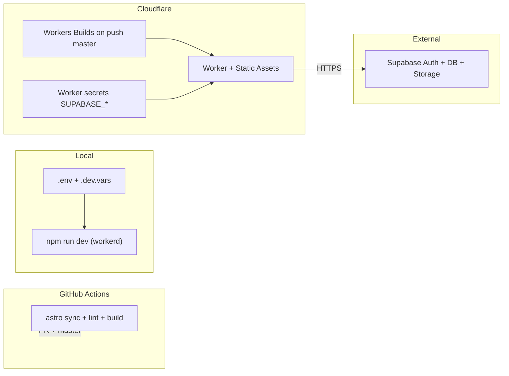

# Cloudflare integration and deployment plan

Aligns with [context/foundation/infrastructure.md](../../foundation/infrastructure.md). The repo is already on the right platform: [`astro.config.mjs`](../../../astro.config.mjs) uses `output: "server"` + `adapter: cloudflare()`, and [`wrangler.jsonc`](../../../wrangler.jsonc) targets Workers + Static Assets with `nodejs_compat`. **No adapter migration** is required.

**Deploy model:** manual `wrangler deploy` for emergencies + **Cloudflare Workers Builds** (GitHub app) auto-promote on push to `master`. Keep [`.github/workflows/ci.yml`](../../../.github/workflows/ci.yml) as **lint + build only** — do **not** add `wrangler-action` deploy unless you remove Cloudflare Builds, or you risk double-deploys and dashboard/CLI conflicts ([community thread](https://community.cloudflare.com/t/publishing-from-github-repo-fails/800709)).



## Tracking

| Phase | ID | Status |
|-------|-----|--------|
| Prerequisites | `prereq-tooling` | done |
| Doc and naming | `phase-0-docs` | done |
| Wrangler hardening | `phase-1-wrangler` | done |
| Secret parity | `phase-2-secrets` | done |
| Supabase production | `phase-3-supabase` | done |
| Manual deploy | `phase-4-manual-deploy` | done |
| Workers Builds | `phase-5-builds` | pending |
| Operations | `phase-6-ops` | pending |

---

## Prerequisites — tooling and accounts

Complete this section **before** Phase 0. Nothing here requires deploying to production yet.

### Prerequisite checklist (overview)

- [ ] Node.js and npm installed; repo dependencies installed (`npm ci`)
- [ ] Cloudflare account created; Wrangler authenticated locally
- [ ] Supabase project ready (local **or** cloud) with URL + anon key in `.env` and `.dev.vars`
- [ ] GitHub repo secrets set for CI (`SUPABASE_URL`, `SUPABASE_KEY`)
- [ ] (Optional, for Builds later) Cloudflare API token + GitHub app access scoped to this repo

---

### A. Local development baseline

| Requirement | How to verify |
|-------------|----------------|
| **Node.js** | `node -v` — use version from [`.nvmrc`](../../../.nvmrc) (`nvm use` / `fnm use`). Align Cloudflare Builds Node version with whatever you standardize on (CI currently uses **22** in [`.github/workflows/ci.yml`](../../../.github/workflows/ci.yml); reconcile if `.nvmrc` differs). |
| **npm** | `npm -v` |
| **Project deps** | From repo root: `npm ci` |
| **Build sanity** | With Supabase env set (see B): `npx astro sync && npm run lint && npm run build` |

---

### B. Supabase configuration

Paint Ledger uses Supabase **Auth only** today (no custom tables). You need a project URL and the **anon (public) key** — never put the **service_role** key in the Worker, GitHub, or local `.env` used by the app.

#### Path 1 — Local Supabase (Docker, good for offline dev)

Requires [Docker Desktop](https://www.docker.com/) (~7 GB RAM).

- [ ] Copy env template:
  ```bash
  cp .env.example .env
  cp .env.example .dev.vars
  ```
- [ ] Initialize Supabase in the repo (creates `supabase/` config; safe to commit config, not secrets):
  ```bash
  npx supabase init
  ```
- [ ] Start local stack (first run downloads images):
  ```bash
  npx supabase start
  ```
- [ ] Copy printed credentials into **both** `.env` and `.dev.vars`:
  ```
  SUPABASE_URL=http://127.0.0.1:54321
  SUPABASE_KEY=<anon key from CLI output>
  ```
- [ ] Open Studio: `http://localhost:54323` — confirm project is healthy.
- [ ] **Auth URL config (local):** Dashboard → **Authentication → URL configuration**
  - Site URL: `http://localhost:4321` (Astro default dev port)
  - Redirect URLs: add `http://localhost:4321/**` (or at minimum `http://localhost:4321`)
- [ ] **Skip email confirmation (optional, dev only):** Authentication → Email → **Confirm email** → off — so sign-up works without inbox (see [README](../../../README.md)).
- [ ] Stop stack when done: `npx supabase stop`

**Edge-case support (local):**

- [ ] `supabase start` fails: ensure Docker is running; check port conflicts on `54321` / `54323`.
- [ ] Auth works in Studio but not in app: confirm `.dev.vars` exists (Wrangler/Astro Cloudflare adapter reads it for workerd dev) **and** matches `.env`.

#### Path 2 — Cloud Supabase (required for production deploy)

Use a dedicated project for Paint Ledger (do not reuse a personal experiment project if RLS/Storage will grow later).

- [ ] Create project at [supabase.com/dashboard](https://supabase.com/dashboard) → note **project ref** and region.
- [ ] **Settings → API:**
  - `SUPABASE_URL` = Project URL (`https://<project-ref>.supabase.co`)
  - `SUPABASE_KEY` = **anon** `public` key (not `service_role`)
- [ ] Write the same pair to `.env`, `.dev.vars`, and (later) Cloudflare Worker secrets + GitHub Actions secrets.
- [ ] **Authentication → URL configuration** (update again after first Worker deploy when you know the URL):
  - Site URL: production Worker URL (e.g. `https://paint-ledger.<subdomain>.workers.dev`)
  - Redirect URLs:
    - `http://localhost:4321/**` (local dev)
    - `https://<production-host>/**` (Workers or custom domain)
- [ ] **Authentication → Providers → Email:** enabled (default).
- [ ] **Production email confirmation:** leave **Confirm email** on unless you intentionally want password sign-up without inbox verification.
- [ ] (Optional) **Authentication → Email templates:** customize confirm/sign-in emails for production branding.

**Edge-case support (cloud):**

- [ ] Sign-in redirects to wrong host: Site URL must match the browser origin exactly (scheme + host, no trailing path).
- [ ] “Invalid API key” in Worker logs: wrong key type (service_role vs anon) or typo; re-copy from Settings → API.
- [ ] CORS is usually not an issue for server-side `@supabase/ssr` cookie auth; if you add browser-direct Supabase calls later, configure allowed origins in Supabase.

#### Supabase CLI reference (both paths)

| Command | Purpose |
|---------|---------|
| `npx supabase --version` | Verify CLI (devDependency in [package.json](../../../package.json)) |
| `npx supabase status` | Local stack URLs and keys (when running) |
| `npx supabase db reset` | Reset local DB (only when you add migrations later) |

**Verify locally before deploy:**

```bash
npm run dev
# → http://localhost:4321 — sign up, sign in, open /dashboard, sign out
```

---

### C. Cloudflare CLI (Wrangler) configuration

Wrangler is already a devDependency (`wrangler` ^4.90). Use `npx wrangler` so the version matches the repo.

#### C.1 — Account and login

- [ ] Create a [Cloudflare account](https://dash.cloudflare.com/sign-up) (free tier is sufficient for MVP).
- [ ] Log in from the terminal (opens browser OAuth):
  ```bash
  npx wrangler login
  ```
- [ ] Confirm identity:
  ```bash
  npx wrangler whoami
  ```
  Note your **Account ID** and **Account Name** — needed for dashboard and optional API tokens.

**Edge-case support:**

- [ ] `wrangler login` hangs or fails: try `npx wrangler logout` then login again; ensure no corporate proxy blocks `*.cloudflare.com`.
- [ ] Wrong account selected: `wrangler logout` → login with the account that should own the Worker.

#### C.2 — Verify project binding

From repo root (after `npm ci`):

```bash
npx wrangler validate
# or inspect config:
npx wrangler deploy --dry-run
```

- [ ] [`wrangler.jsonc`](../../../wrangler.jsonc) is picked up (`name`, `main`, `assets`, `compatibility_flags`).
- [ ] No error about missing `dist/` before first build — run `npm run build` first for a real deploy dry run.

#### C.3 — API token (for CI/CD and Builds, not required for first manual deploy)

Manual `wrangler deploy` after `wrangler login` uses OAuth and does **not** need an API token. Create a token when you connect **Workers Builds** or automate deploy elsewhere.

- [ ] Cloudflare dashboard → **My Profile → API Tokens → Create Token**
- [ ] Use template **Edit Cloudflare Workers** (or custom with permissions):
  - Account: **Workers Scripts** — Edit
  - Account: **Workers KV / R2** — only if you add bindings later
  - Zone: not required unless using custom domains via API
- [ ] Store token as GitHub secret `CLOUDFLARE_API_TOKEN` only if you add `wrangler-action` (this plan uses **Cloudflare Builds** instead; Builds uses the GitHub app, not necessarily this token).
- [ ] Optional: `CLOUDFLARE_ACCOUNT_ID` as GitHub secret if a workflow requires `accountId`.

**Edge-case support:**

- [ ] Token deploy fails with 403: token missing Workers Scripts permission or wrong account.
- [ ] Never commit API tokens; never log them in CI output (Wrangler action masks them by default).

#### C.4 — Worker secrets (runtime; do after first deploy or before if using dashboard)

Secrets are **not** stored in `wrangler.jsonc`. Set them per Worker:

```bash
npx wrangler secret put SUPABASE_URL
npx wrangler secret put SUPABASE_KEY
```

- [ ] List secrets (names only): `npx wrangler secret list`
- [ ] Dashboard alternative: Workers & Pages → your Worker → **Settings → Variables and Secrets → Encrypt**

Use the **same** Supabase URL and anon key as local/cloud `.env` for the environment you are deploying (prod project for prod Worker).

#### C.5 — Useful Wrangler commands (reference)

| Command | When to use |
|---------|-------------|
| `npx wrangler dev` | Optional; raw Worker preview. Day-to-day app dev uses `npm run dev` (Astro + workerd). |
| `npx wrangler deploy` | Manual production/preview deploy |
| `npx wrangler tail` | Live logs after deploy |
| `npx wrangler deployments list` | Version history |
| `npx wrangler rollback` | Revert active deployment (code/assets only) |

---

### D. GitHub prerequisites (CI + future Builds)

- [ ] Repository on GitHub with `master` as the integration branch (matches [ci.yml](../../../.github/workflows/ci.yml)).
- [ ] **Settings → Secrets and variables → Actions → Repository secrets:**
  - `SUPABASE_URL` — cloud project URL (for `npm run build` in CI)
  - `SUPABASE_KEY` — anon key
- [ ] Confirm CI passes on a PR: lint + build with those secrets.
- [ ] (Phase 5) Install [Cloudflare Workers & Pages GitHub app](https://developers.cloudflare.com/workers/ci-cd/builds/git-integration/github-integration/) — restrict to **only** the `paint-ledger` repo.

**Edge-case:** Fork PRs from untrusted contributors do not receive repository secrets — expected; do not enable production Builds on fork PRs without a separate preview Supabase project.

---

### E. Prerequisites “done” gate

Proceed to Phase 0 only when all are true:

- [ ] `npm run dev` works with sign-in and `/dashboard` protection locally
- [ ] `npm run build` succeeds with Supabase env vars set
- [ ] `npx wrangler whoami` shows the intended Cloudflare account
- [ ] Cloud Supabase project exists with Auth URL config for `localhost:4321` (production URL can be added after first deploy)

---

## Phase 0 — Doc and naming alignment

- [x] Update [context/foundation/tech-stack.md](../../foundation/tech-stack.md) hint: `deployment_target: cloudflare-pages` → **Cloudflare Workers** (adapter v13+; avoids Pages-vs-Workers incident confusion per infrastructure risk register).
- [x] Rename Worker in [`wrangler.jsonc`](../../../wrangler.jsonc): `"name": "10x-astro-starter"` → `"paint-ledger"` (or your final subdomain). Re-run first deploy after rename so dashboard/CLI names match.
- [x] Add a short **deploy runbook** section to [README.md](../../../README.md) covering: three secret surfaces (local `.env`/`.dev.vars`, GitHub build secrets, Cloudflare Worker secrets), rollback limits, and “Worker rollback ≠ Supabase rollback”.

---

## Phase 1 — Wrangler hardening (pre-deploy)

Current config is mostly correct; add flags from Astro/Workers issue research before first production traffic.

**Target `wrangler.jsonc` changes:**

```jsonc
{
  "name": "paint-ledger",
  "main": "@astrojs/cloudflare/entrypoints/server",
  "compatibility_date": "2026-05-08",
  "compatibility_flags": ["nodejs_compat", "disable_nodejs_process_v2"],
  "assets": {
    "binding": "ASSETS",
    "directory": "./dist",
    "not_found_handling": "404-page",
    "run_worker_first": ["/*", "!/_astro/*"]
  },
  "observability": { "enabled": true }
}
```

| Change | Why |
|--------|-----|
| `disable_nodejs_process_v2` | Prevents `[object Object]` SSR responses when `nodejs_compat` + recent compat dates ([astro#14511](https://github.com/withastro/astro/issues/14511)) |
| `run_worker_first: ["/*", "!/_astro/*"]` | Ensures middleware runs on cold SSR hits; without it, static asset layer can serve landing page instead of protected routes ([DEV migration note](https://dev.to/garyedgekits/how-i-migrated-from-astro-5-to-6-with-all-my-react-islands-2k8m)) |
| Keep `nodejs_compat` | Required for `@supabase/ssr` on Workers ([supabase#37592](https://github.com/supabase/supabase/issues/37592)) |

**Edge-case support steps:**

- [x] If build fails with `Fetch API cannot load: /` during prerender: set `prerender = false` on affected routes or add `cloudflare({ prerenderEnvironment: 'node' })` in [`astro.config.mjs`](../../../astro.config.mjs) ([astro#16190](https://github.com/withastro/astro/issues/16190)). *(Not needed — `npm run build` passed without prerender changes.)*
- [ ] After any `@astrojs/cloudflare` / `wrangler` upgrade: run `npm run dev`, `npm run build`, then auth smoke test (sign-in, protected route, sign-out).

---

## Phase 2 — Local and CI secret parity

> **Prerequisites:** Local `.env` / `.dev.vars` and GitHub secrets should already be set per **§ B** and **§ D**. This phase verifies parity across all three surfaces before production.

Three independent surfaces (infrastructure “secrets drift” risk):

| Surface | Variables | Purpose |
|---------|-----------|---------|
| Local | `.env` + `.dev.vars` | `astro dev` / local SSR |
| GitHub Actions | `SUPABASE_URL`, `SUPABASE_KEY` | CI `npm run build` only ([ci.yml](../../../.github/workflows/ci.yml)) |
| Cloudflare Worker | `SUPABASE_URL`, `SUPABASE_KEY` | **Runtime** on deployed Worker |

- [x] Copy [`.env.example`](../../../.env.example) → `.env` and `.dev.vars` with cloud Supabase **anon** key (matches [README](../../../README.md); never service role in the Worker).
- [x] Confirm GitHub repo secrets `SUPABASE_URL` and `SUPABASE_KEY` exist (CI already expects them). *(Assumed per prerequisites gate; verify in GitHub → Settings → Secrets if CI fails.)*
- [x] Document rotation checklist: Supabase dashboard → `wrangler secret put` → GitHub secrets → redeploy. *(Added to [README](../../../README.md) Secret surfaces section.)*

**Edge-case:** `astro:env` marks secrets `optional: true` in [`astro.config.mjs`](../../../astro.config.mjs); missing runtime secrets yield `createClient() === null` and auth silently disabled ([`src/lib/supabase.ts`](../../../src/lib/supabase.ts)). After deploy, verify config banner / sign-in does not show “Supabase is not configured”.

---

## Phase 3 — Supabase external integration (production)

> **Prerequisites:** Cloud Supabase project and API keys from **§ B Path 2**. This phase finalizes production Auth URLs after you know the Worker hostname.

Auth is cookie-based via [`src/lib/supabase.ts`](../../../src/lib/supabase.ts) and [`src/middleware.ts`](../../../src/middleware.ts) (`PROTECTED_ROUTES`). No Storage/DB tables yet, but production URL must be registered before auth works.

- [x] Confirm **hosted** Supabase project is the one used in production secrets (not local `127.0.0.1`). *(Worker secrets set via CLI; prod homepage shows no “not configured” banner.)*
- [x] **Authentication → URL configuration** (update with live Worker URL in Supabase dashboard):
  - Site URL: `https://paint-ledger.mateusz-raubo.workers.dev`
  - Redirect URLs: `https://paint-ledger.mateusz-raubo.workers.dev/**`, `http://localhost:4321/**`
- [x] **API keys:** use **anon** `public` key as `SUPABASE_KEY` (server-only via `astro:env`; not bundled to client today).
- [ ] Email confirmation: match README dev shortcut only in non-prod; production should keep confirmation on unless you explicitly disable it.
- [ ] (Later, when Storage/RLS land) plan **staging Supabase project** for migrations; treat migrations as forward-only — `wrangler rollback` does not revert schema (infrastructure pre-mortem).

**Edge-case support steps:**

- [ ] Cookie/auth failures after deploy: check Site URL matches exact scheme/host; tail Worker (`npx wrangler tail`) and Supabase Auth logs.
- [ ] Intermittent auth under load: edge isolates × many Supabase clients — acceptable for MVP; if it worsens, consider connection pooling / Hyperdrive later (out of scope for MVP per infrastructure.md).

---

## Phase 4 — First manual production deploy

> **Prerequisites:** **§ C** (Wrangler login) and **§ B Path 2** (cloud Supabase). Worker runtime secrets: **§ C.4**.

Per [infrastructure.md Getting Started](../../foundation/infrastructure.md):

- [x] Confirm `npx wrangler whoami` (skip `login` if already authenticated per **§ C.1**)
- [x] `npm run build` locally (with Supabase env set) — confirm `dist/` output.
- [x] `npx wrangler secret put SUPABASE_URL` and `SUPABASE_KEY`
- [x] `npx wrangler deploy` → **https://paint-ledger.mateusz-raubo.workers.dev** (Version `03c74694-9e86-448a-a630-81da9e7baed1`)
- [ ] **Smoke test** (manual checklist):
  - [x] `GET /` — 200
  - [x] `GET /dashboard` unauthenticated → redirect to `/auth/signin`
  - [x] Sign up / sign in → `GET /dashboard` → 200
  - [ ] Sign out → session cleared
  - [ ] `npx wrangler tail` — no `stream` / `nodejs_compat` errors
- [ ] Optional: attach custom domain in Workers dashboard (DNS + SSL); update Supabase Site URL again.

**Edge-case support steps:**

- [ ] Dashboard vs CLI conflict: if Builds is connected later, prefer **one** publish path. If you see “last published via Dashboard” warnings, avoid alternating dashboard edits and CLI deploys; use Builds or CLI consistently.
- [ ] Rollback drill: `npx wrangler deployments list` → `npx wrangler rollback` → re-run auth smoke test. Confirm Supabase data unchanged.

---

## Phase 5 — Cloudflare Workers Builds (auto-deploy on `master`)

Connect repo in dashboard: **Workers & Pages → your Worker → Settings → Builds → Connect GitHub** ([Cloudflare Builds docs](https://developers.cloudflare.com/workers/ci-cd/builds/)).

Recommended build settings:

| Setting | Value |
|---------|--------|
| Production branch | `master` |
| Build command | `npm ci && npx astro sync && npm run build` |
| Deploy command | `npx wrangler deploy` |
| Root directory | `/` (repo root) |
| Node version | `22` (match [`.nvmrc`](../../../.nvmrc) / CI) |

- [ ] Install **Cloudflare Workers & Pages** GitHub app; scope to this repo only.
- [ ] Add **build environment variables** in Cloudflare Builds (not just Worker secrets): `SUPABASE_URL`, `SUPABASE_KEY` — required for `astro:env` at build time.
- [ ] Add **Worker secrets** in dashboard (same names) for runtime — Builds `secrets:` in wrangler-action is an alternative only if you drop Builds.
- [ ] Push to `master` → confirm build + deploy in Cloudflare dashboard and GitHub commit status.
- [ ] Keep GitHub Actions CI on PRs + `master` (no deploy step) as the quality gate before Cloudflare promotes.

**Edge-case support steps:**

- [ ] Build passes but auth broken: Builds env vars missing at **build** vs **runtime** — set both.
- [ ] To ship versions without promoting: deploy command `npx wrangler versions upload` (infrastructure preview pattern); manual promote from dashboard.
- [ ] Fork PRs: do not enable auto-preview with production secrets unless using scoped preview env + Cloudflare Access (infrastructure unknown-unknown).

---

## Phase 6 — Operations and observability

- [ ] Enable / verify **Observability** (already `observability.enabled` in wrangler).
- [ ] Document on-call commands in README: `wrangler tail`, `wrangler deployments list`, `wrangler rollback`.
- [ ] Optional: Cloudflare MCP in Cursor ([agent setup](https://developers.cloudflare.com/agent-setup/cursor/)) for read-only deploy/version queries.
- [ ] Human approval policy (from infrastructure.md): you approve production secret rotation and destructive Supabase changes; agents may run lint/build/tail only.

**CPU / SSR mitigation (as features grow):**

- [ ] Prerender static marketing [`src/pages/index.astro`](../../../src/pages/index.astro) when content stabilizes.
- [ ] Keep auth routes and [`/dashboard`](../../../src/pages/dashboard.astro) SSR (`prerender = false`).
- [ ] Monitor Workers CPU in dashboard before free-tier limits (10 ms CPU/invocation on free tier).

---

## Phase 7 — Out of scope (explicitly deferred)

Tracked in infrastructure.md; not part of this integration pass:

- Docker / multi-region HA
- GitHub Actions `wrangler-action` deploy (redundant if Builds owns deploy)
- Preview deployments for every PR (unless you add Phase 5b later)
- Hyperdrive / D1 / R2 (Supabase remains system of record)
- Full E2E test suite (manual smoke checklist until tests exist)

---

## Files likely touched during implementation

| File | Change |
|------|--------|
| [`wrangler.jsonc`](../../../wrangler.jsonc) | Worker name, compat flags, `run_worker_first` |
| [`README.md`](../../../README.md) | Deploy runbook, Builds setup, secret surfaces |
| [`context/foundation/tech-stack.md`](../../foundation/tech-stack.md) | Workers naming hint |
| [`.github/workflows/ci.yml`](../../../.github/workflows/ci.yml) | Unchanged (lint+build); optional comment noting Builds handles deploy |
| [`astro.config.mjs`](../../../astro.config.mjs) | Only if prerender/build edge cases appear |

---

## Success criteria

- Production Worker URL serves the app with working Supabase auth and protected routes.
- Push to `master` triggers Cloudflare Builds deploy without manual CLI.
- Manual `wrangler deploy` still works for hotfixes.
- CI on PRs continues to pass lint + build with GitHub Supabase secrets.
- Team can roll back Worker version in minutes without assuming DB rollback.
